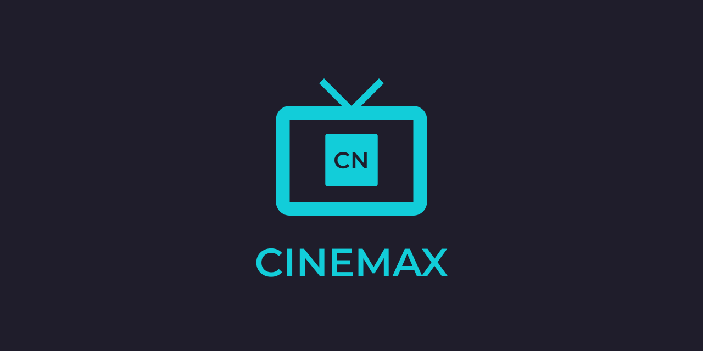
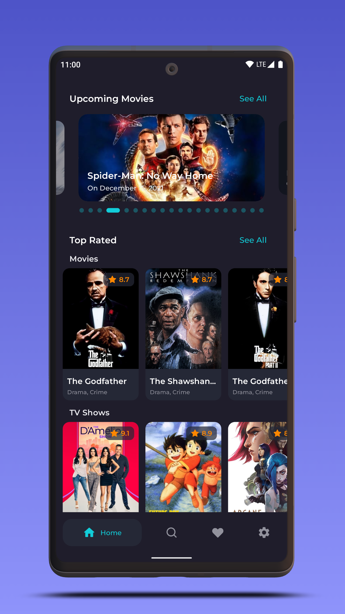
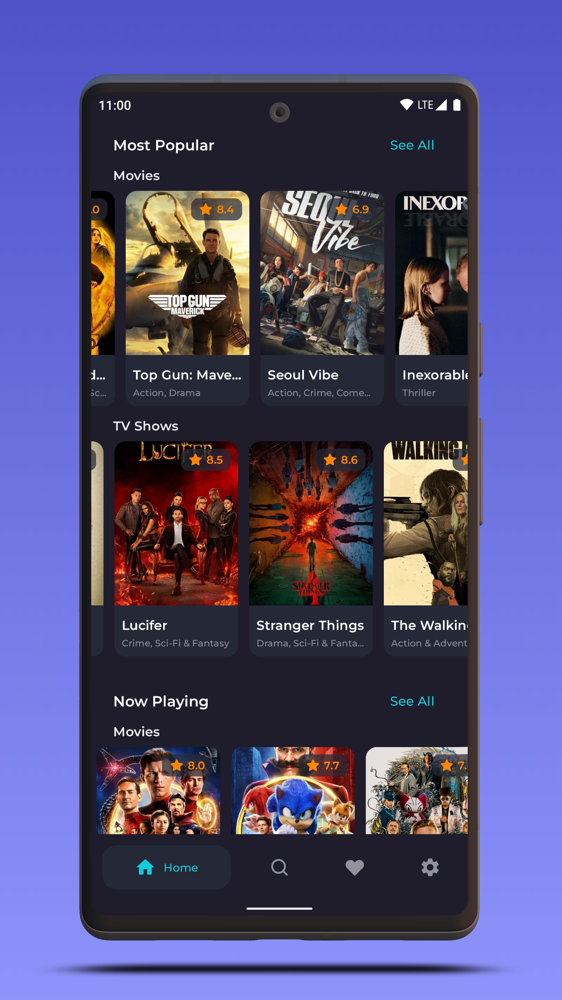
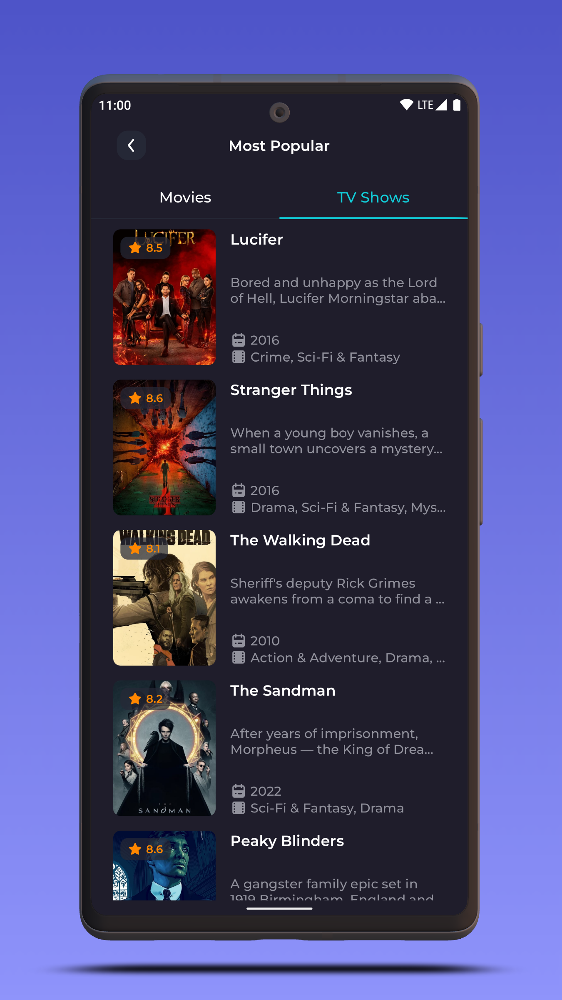
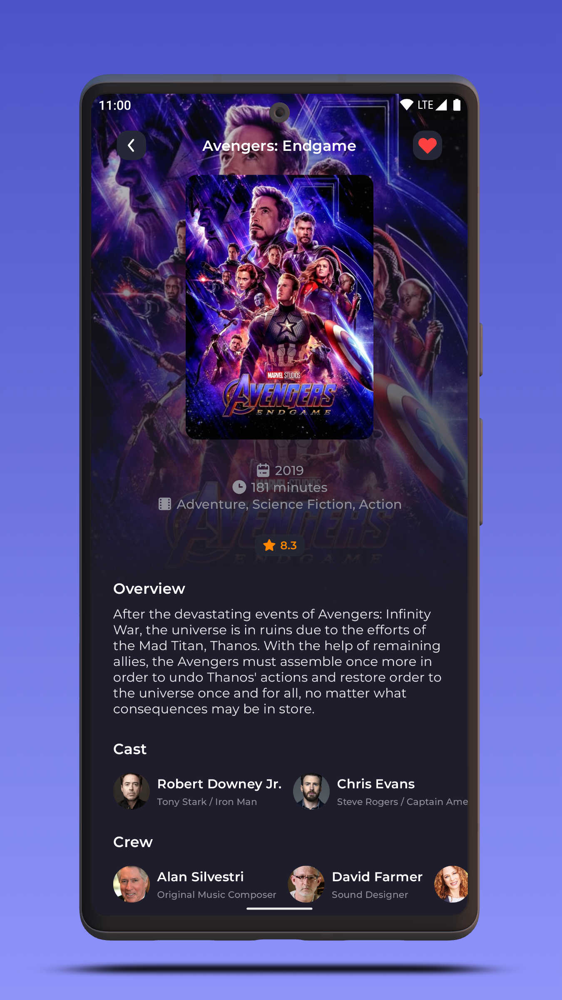
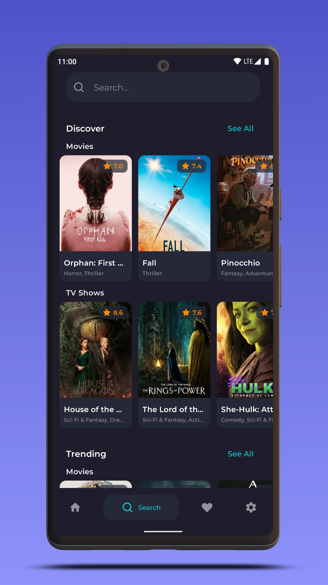
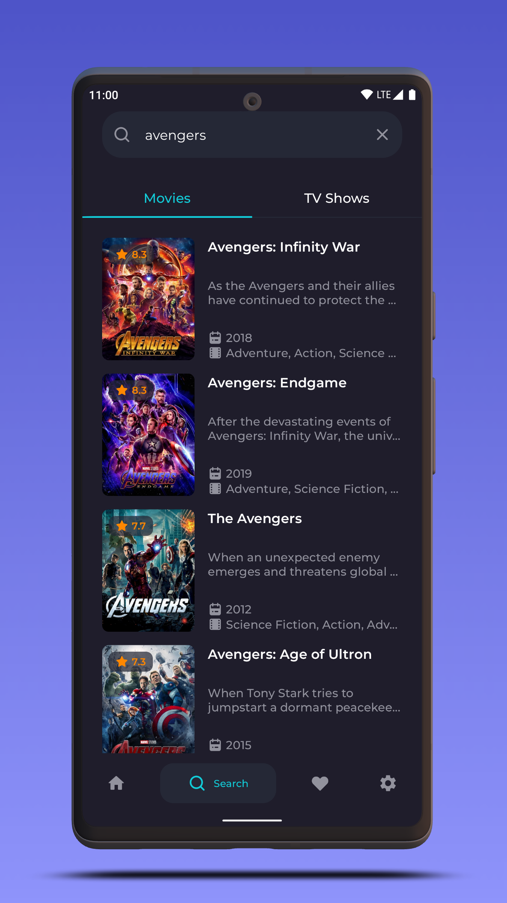
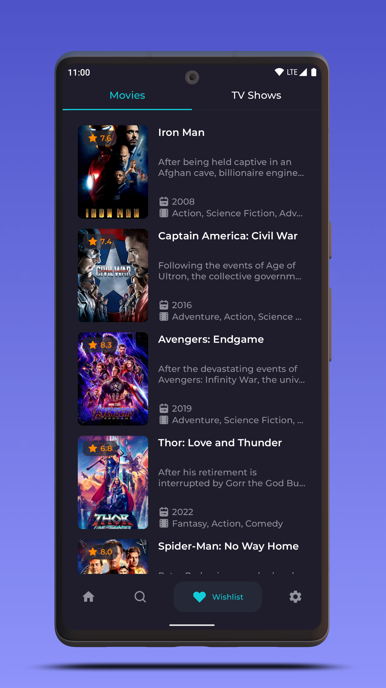
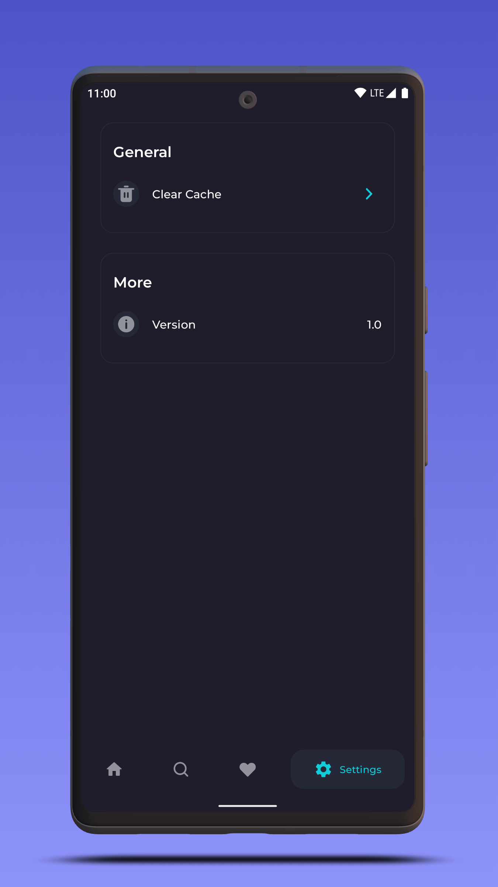

# Cinemax

Cinemax is a Movies & TV Shows application for Android.

# Preview

<p align="center">
  
  
  
  
</p>

<p align="center">
  
  
  
  
</p>

# Build

- Generate an API key from [The Movie Database](https://www.themoviedb.org/).
- Put the key in the `local.properties` file.

```
cinemax.apikey=YOUR_API_KEY_HERE
```

# Credits

- Design on [Figma](https://www.figma.com/community/file/1088719884686291024).

# License

```
Copyright 2022 Maximillian Leonov

Licensed under the Apache License, Version 2.0 (the "License");
you may not use this file except in compliance with the License.
You may obtain a copy of the License at

    http://www.apache.org/licenses/LICENSE-2.0

Unless required by applicable law or agreed to in writing, software
distributed under the License is distributed on an "AS IS" BASIS,
WITHOUT WARRANTIES OR CONDITIONS OF ANY KIND, either express or implied.
See the License for the specific language governing permissions and
limitations under the License.
```
