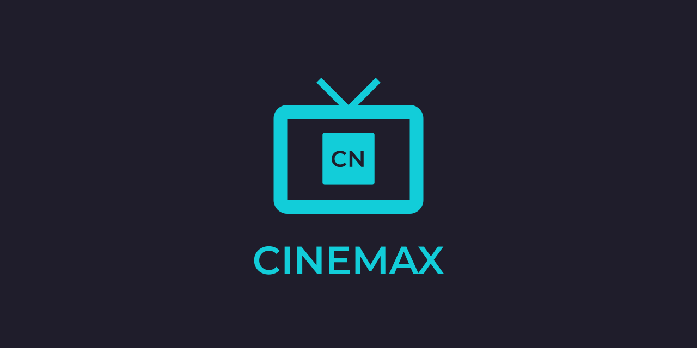
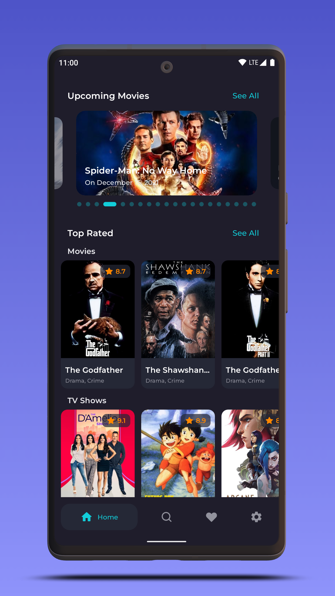
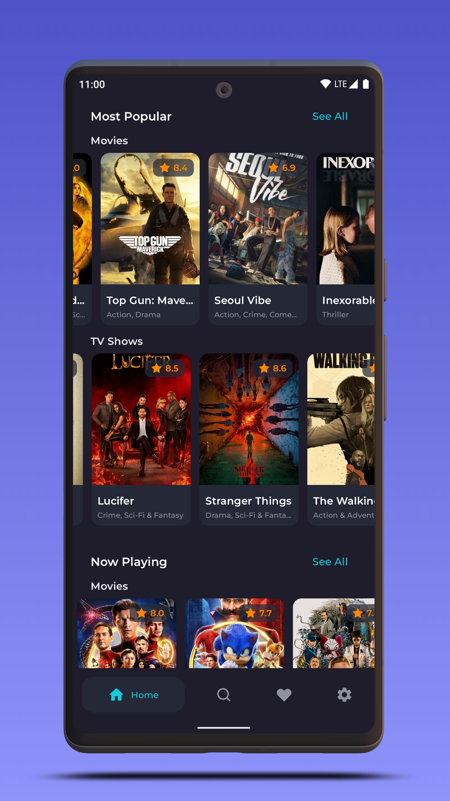
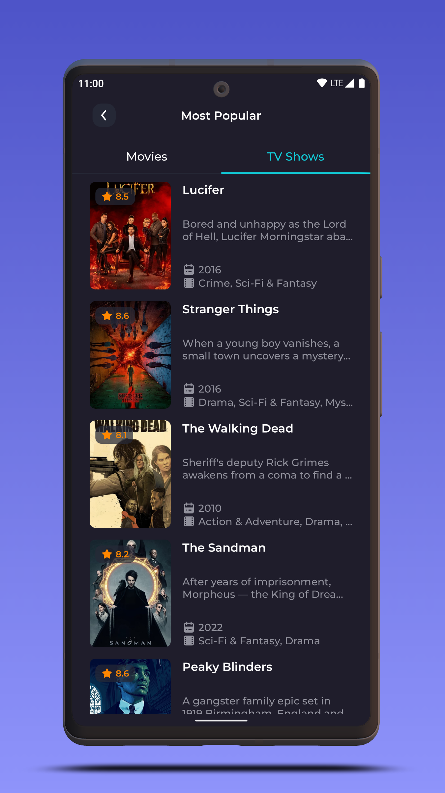
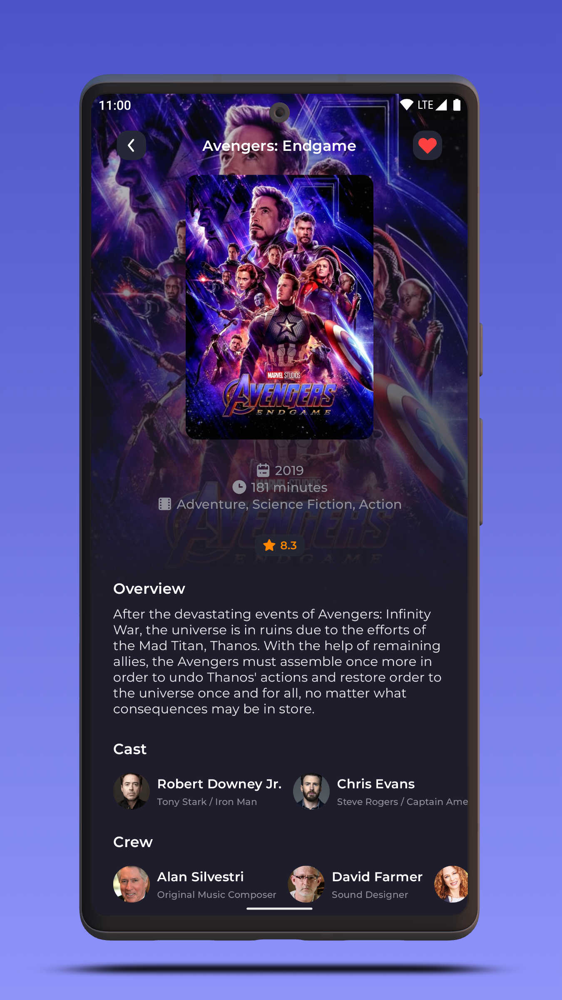
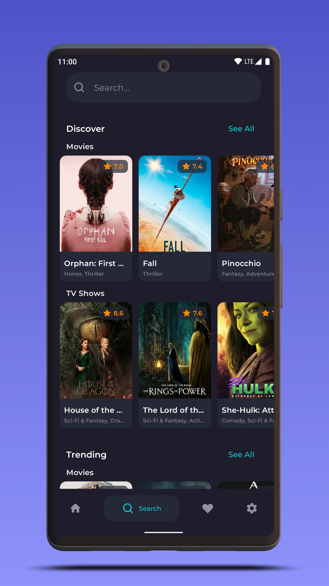
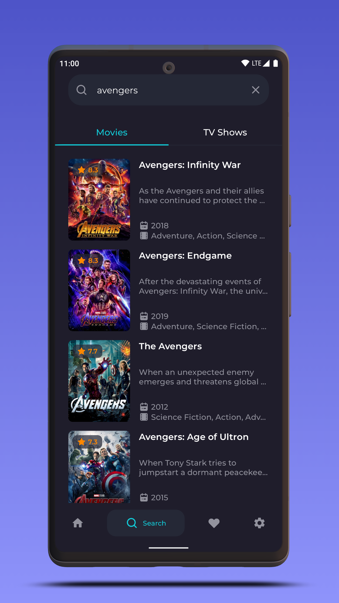
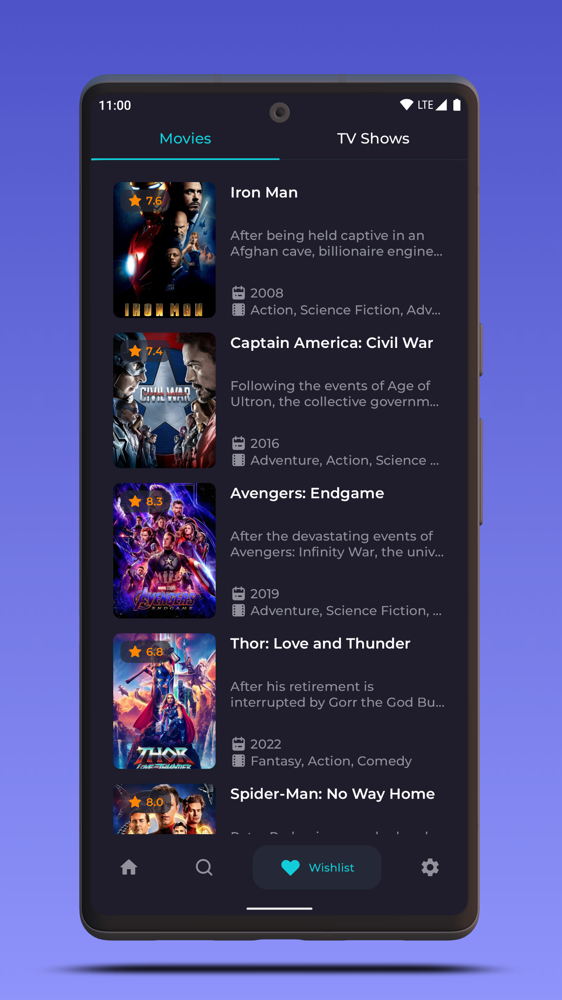
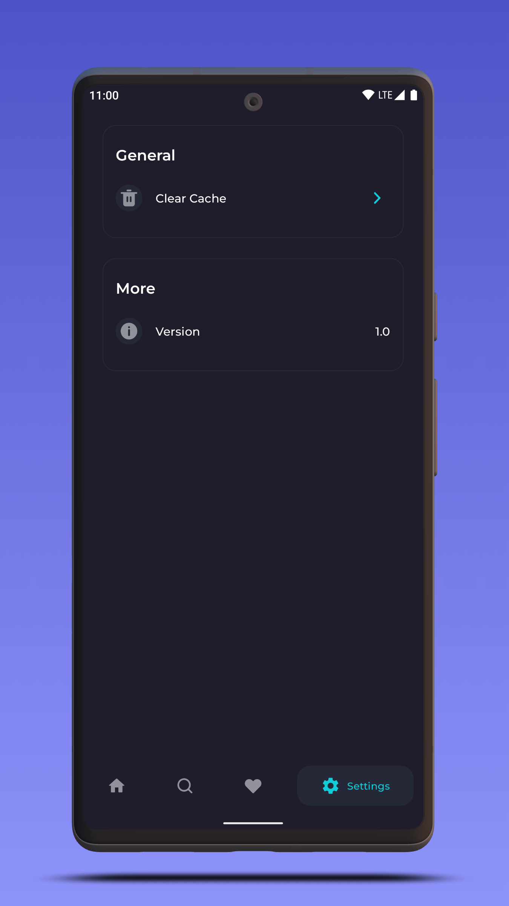
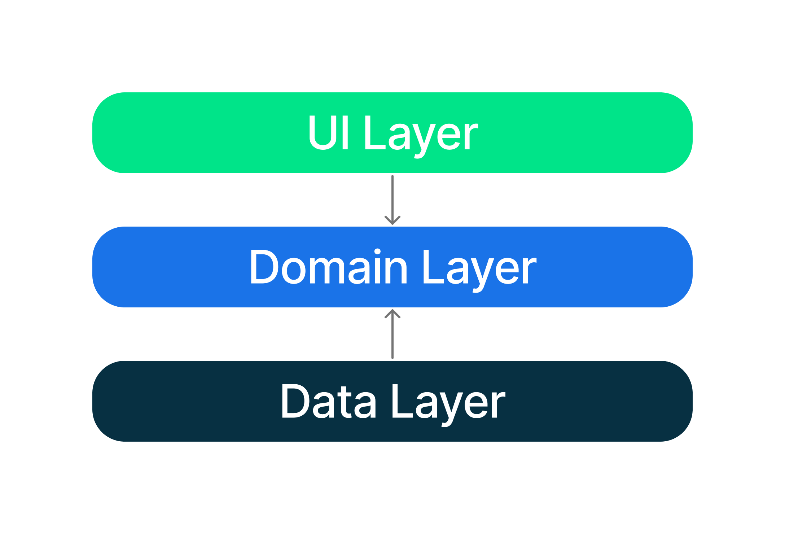

# Cinemax

Cinemax is a Movies & TV Shows application for Android.

<a href='https://play.google.com/store/apps/details?id=com.maximillianleonov.cinemax&pcampaignid=pcampaignidMKT-Other-global-all-co-prtnr-py-PartBadge-Mar2515-1'></a>
[](https://apt.izzysoft.de/fdroid/index/apk/com.maximillianleonov.cinemax)

or get the apk from the [Releases section](https://github.com/MaximillianLeonov/Cinemax/releases/latest).

# Preview






# Getting Started

- Generate an API key from [The Movie Database](https://www.themoviedb.org/).
- Put the key in the `local.properties` file.

```properties
cinemax.apikey=YOUR_API_KEY_HERE
```

# Development Environment

**Cinemax** uses the Gradle build system and can be imported directly into the latest stable version
of Android Studio (available [here](https://developer.android.com/studio)). The `debug`
build can be built and run using the default configuration.

Once you're up and running, you can refer to the learning journeys below to get a better
understanding of which libraries and tools are being used, the reasoning behind the approaches to
UI, testing, architecture and more, and how all of these different pieces of the project fit
together to create a complete app.

# Build

The app contains the usual `debug` and `release` build variants.

In addition, the `benchmark` variant of `app` is used to test startup performance and generate a
baseline profile (see below for more information).

For normal development use the `debug` variant. For UI performance testing use the `release`
variant.

# Architecture

The **Cinemax** app follows the
[official architecture guidance](https://developer.android.com/topic/architecture)
and is described in detail in the
[architecture learning journey](docs/ArchitectureLearningJourney.md).



# Modularization

The **Cinemax** app has been fully modularized and you can find the detailed guidance and
description of the modularization strategy used in
[modularization learning journey](docs/ModularizationLearningJourney.md).


# UI

UI components are designed according to the custom design system and built entirely
using [Jetpack Compose](https://developer.android.com/jetpack/compose).

The app has a light and dark theme that uses predefined colors.

Find out more about the [UI architecture here](docs/ArchitectureLearningJourney.md#ui-layer).

# Baseline profiles

The baseline profile for this app is located
at [`app/src/main/baseline-prof.txt`](app/src/main/baseline-prof.txt). It contains rules that enable
AOT compilation of the critical user path taken during app launch. For more information on baseline
profiles, read [this document](https://developer.android.com/studio/profile/baselineprofiles).

> **Note**: The baseline profile needs to be re-generated for release builds that touch code which changes app startup.

To generate the baseline profile, select the `benchmark` build variant and run the
`BaselineProfileGenerator` benchmark test on an AOSP Android Emulator. Then copy the resulting
baseline profile from the emulator
to [`app/src/main/baseline-prof.txt`](app/src/main/baseline-prof.txt).

# Credits

- Design on [Figma](https://www.figma.com/community/file/1088719884686291024).

# License

```
Copyright 2022 Maximillian Leonov

Licensed under the Apache License, Version 2.0 (the "License");
you may not use this file except in compliance with the License.
You may obtain a copy of the License at

    http://www.apache.org/licenses/LICENSE-2.0

Unless required by applicable law or agreed to in writing, software
distributed under the License is distributed on an "AS IS" BASIS,
WITHOUT WARRANTIES OR CONDITIONS OF ANY KIND, either express or implied.
See the License for the specific language governing permissions and
limitations under the License.
```
