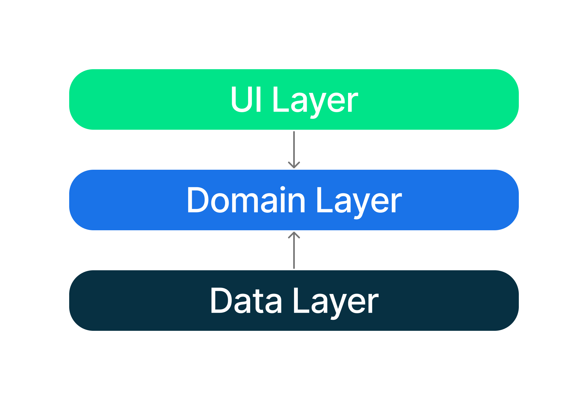

# Architecture Learning Journey

In this learning journey you will learn about the Cinemax app architecture: its layers, key classes
and the interactions between them.

## Goals and requirements

The goals for the app architecture are:

- Follow the [official architecture guidance](https://developer.android.com/jetpack/guide) as
  closely as possible.
- Easy for developers to understand, nothing too experimental.
- Support multiple developers working on the same codebase.
- Facilitate local and instrumented tests, both on the developer’s machine and using Continuous
  Integration (CI).
- Minimize build times.

## Architecture overview

The app architecture has three layers:
a [UI layer](https://developer.android.com/jetpack/guide/ui-layer),
a [data layer](https://developer.android.com/jetpack/guide/data-layer) and
a [domain layer](https://developer.android.com/jetpack/guide/domain-layer).

The architecture follows a reactive programming model
with [unidirectional data flow](https://developer.android.com/jetpack/guide/ui-layer#udf). With the
data layer at the bottom, the key concepts are:

- Higher layers react to changes in lower layers.
- Events flow down.
- Data flows up.

The data flow is achieved using streams, implemented
using [Kotlin Flows](https://developer.android.com/kotlin/flow).

## Data layer

The data layer is implemented as an offline-first source of app data and business logic. It is the
source of truth for all data in the app.

### Reading data

Data is exposed as data streams. This means each client of the repository must be prepared to react
to data changes.

### Writing data

To write data, the repository provides suspend functions. It is up to the caller to ensure that
their execution is suitably scoped.

### Data sources

A repository may depend on one or more data sources. For example, the `MovieRepositoryImpl`
depends on the following data sources:

<table>
  <tr>
   <td><strong>Name</strong>
   </td>
   <td><strong>Backed by</strong>
   </td>
   <td><strong>Purpose</strong>
   </td>
  </tr>
  <tr>
   <td>MovieDatabaseDataSource
   </td>
   <td><a href="https://developer.android.com/training/data-storage/room">Room/SQLite</a>
   </td>
   <td>Persistent relational data associated with Movies.
   </td>
  </tr>
  <tr>
   <td>MovieNetworkDataSource
   </td>
   <td>Remote API accessed using Retrofit
   </td>
   <td>Data for movies, provided through REST API endpoints as JSON.
   </td>
  </tr>
</table>

## Domain Layer

Each repository has its own models. For example, the `MovieRepository` has a `MovieModel` model and
the `TvShowRepository` has a `TvShowModel` model.

Each repository method has its own use case. For example, the `GetMoviesUseCase` and
the `GetTvShowsUseCase`.

Use cases are the public API for other layers, they provide the _only_ way to access the app data.
The use cases typically offer one or more methods for reading and writing data.

## UI Layer

The [UI layer](https://developer.android.com/topic/architecture/ui-layer) comprises:

- UI elements built using [Jetpack Compose](https://developer.android.com/jetpack/compose)
- [Android ViewModels](https://developer.android.com/topic/libraries/architecture/viewmodel)

The ViewModels receive streams of data from repositories and transform them into UI state. The UI
elements reflect this state, and provide ways for the user to interact with the app. These
interactions are passed as events to the view model where they are processed.

### Modeling UI state

UI state is modeled as a sealed hierarchy using interfaces and immutable data classes. State objects
are only ever emitted through the transform of data streams. This approach ensures that:

- the UI state always represents the underlying app data - the app data is the source-of-truth.
- the UI elements handle all possible states.

### Transforming streams into UI state

View models receive streams of data as
cold [flows](https://kotlin.github.io/kotlinx.coroutines/kotlinx-coroutines-core/kotlinx.coroutines.flow/-flow/index.html)
from one or more use cases. These are collected and the view model updates the corresponding UI
state.

### Processing user interactions

User actions are communicated from UI elements to view models using regular method invocations.
These methods are passed to the UI elements as lambda expressions.

## Further reading

- [Guide to app architecture](https://developer.android.com/topic/architecture)
- [Jetpack Compose](https://developer.android.com/jetpack/compose)
