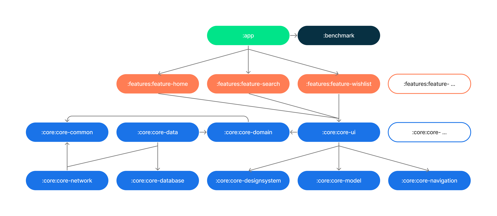

# Modularization learning journey

In this learning journey you will learn about modularization, and the modularization strategy used
to create the modules in the Cinemax app.

## Overview

Modularization is the practice of breaking the concept of a monolithic, one-module codebase into
loosely coupled, self contained modules.

### Benefits of modularization

This offers many benefits, including:

**Scalability** - In a tightly coupled codebase, a single change can trigger a cascade of
alterations. A properly modularized project will embrace
the [separation of concerns](https://en.wikipedia.org/wiki/Separation_of_concerns) principle. This
in turn empowers the contributors with more autonomy while also enforcing architectural patterns.

**Enabling work in parallel** - Modularization helps decrease version control conflicts and enables
more efficient work in parallel for developers in larger teams.

**Ownership** - A module can have a dedicated owner who is responsible for maintaining the code and
tests, fixing bugs, and reviewing changes.

**Encapsulation** - Isolated code is easier to read, understand, test and maintain.

**Reduced build time** - Leveraging Gradle’s parallel and incremental build can reduce build times.

**Dynamic delivery** - Modularization is a requirement
for [Play Feature Delivery](https://developer.android.com/guide/playcore/feature-delivery) which
allows certain features of your app to be delivered conditionally or downloaded on demand.

**Reusability** - Proper modularization enables opportunities for code sharing and building multiple
apps, across different platforms, from the same foundation.

### Modularization pitfalls

However, modularization is a pattern that can be misused, and there are some gotchas to be aware of
when modularizing an app:

**Too many modules** - each module has an overhead that comes in the form of increased complexity of
the build configuration. This can cause Gradle sync times to increase, and incurs an ongoing
maintenance cost. In addition, adding more modules increases the complexity of the project’s Gradle
setup, when compared to a single monolithic module. This can be mitigated by making use of
convention plugins, to extract reusable and composable build configuration into type-safe Kotlin
code. In the Cinemax app, these convention plugins can be found in
the [`build-logic` folder](https://github.com/MaximillianLeonov/Cinemax/tree/main/build-logic).

**Not enough modules** - conversely if your modules are few, large and tightly coupled, you end up
with yet another monolith. This means you lose some benefits of modularization. If your module is
bloated and has no single, well defined purpose, you should consider splitting it.

**Too complex** - there is no silver bullet here. In fact it doesn’t always make sense to modularize
your project. A dominating factor is the size and relative complexity of the codebase. If your
project is not expected to grow beyond a certain threshold, the scalability and build time gains
won’t apply.

## Modularization strategy

It’s important to note that there is no single modularization strategy that fits all projects.
However, there are general guidelines that can be followed to ensure you maximize its benefits and
minimize its downsides.

A barebone module is simply a directory with a Gradle build script inside. Usually though, a module
will consist of one or more source sets and possibly a collection of resources or assets. Modules
can be built and tested independently. Due to Gradle's flexibility there are few constraints as to
how you can organize your project. In general, you should strive for low coupling and high cohesion.

- **Low coupling** - Modules should be as independent as possible from one another, so that changes
  to one module have zero or minimal impact on other modules. They should not possess knowledge of
  the inner workings of other modules.

- **High cohesion** - A module should comprise a collection of code that acts as a system. It should
  have clearly defined responsibilities and stay within boundaries of certain domain knowledge. For
  example,
  the [`core-network` module](https://github.com/MaximillianLeonov/Cinemax/tree/main/core/core-network)
  in Cinemax is responsible for making network requests, handling responses from a remote data
  source, and supplying data to other modules.

## Types of modules in Cinemax

**Top tip**: A module graph (shown above) can be useful during modularization planning for
visualizing dependencies between modules.

The Cinemax app contains the following types of modules:

- The `app` module — contains app level and scaffolding classes that bind the rest of the codebase,
  such as `CinemaxActivity`, `CinemaxApp` and app-level controlled navigation. A good example of
  this is the navigation setup through `CinemaxNavHost` and the bottom navigation bar setup
  through `CinemaxBottomBar`. The `app` module depends on all `feature` modules and required `core`
  modules.

- `feature-` modules — feature specific modules which are scoped to handle a single responsibility
  in the app. These modules can be reused by any app, including test or other flavoured apps, when
  needed, while still keeping it separated and isolated. If a class is needed only by one `feature`
  module, it should remain within that module. If not, it should be extracted into an
  appropriate `core` module. A `feature` module should have no dependencies on other feature
  modules. They only depend on the `core` modules that they require.

- `core-` modules — common library modules containing auxiliary code and specific dependencies that
  need to be shared between other modules in the app. These modules can depend on other core
  modules, but they shouldn’t depend on feature nor app modules.

- Miscellaneous modules — such as `benchmark`.

## Modules

Using the above modularization strategy, the Cinemax app has the following modules:

<table>
  <tr>
   <td><strong>Name</strong>
   </td>
   <td><strong>Responsibilities</strong>
   </td>
   <td><strong>Key classes and good examples</strong>
   </td>
  </tr>
  <tr>
   <td><code>app</code>
   </td>
   <td>Brings everything together required for the app to function correctly. This includes UI scaffolding and navigation. 
   </td>
   <td><code>CinemaxActivity, CinemaxApp</code> 
   App-level controlled navigation via <code>CinemaxNavHost, CinemaxBottomBar</code>
   </td>
  </tr>
  <tr>
   <td><code>feature-home</code> 
   <code>feature-search</code> 
   <code>...</code>
   </td>
   <td>Functionality associated with a specific feature or user journey. Typically contains UI components and ViewModels which read data from other modules. 
   Examples include: 
   <ul>
      <li><a href="https://github.com/MaximillianLeonov/Cinemax/tree/main/features/feature-home"><code>feature-home</code></a> displays information about movies and TV shows on the <code>HomeScreen</code>.</li>
      <li><a href="https://github.com/MaximillianLeonov/Cinemax/tree/main/features/feature-search"><code>feature-search</code></a> search for movies and TV shows on the <code>SearchScreen</code>.</li>
      </ul>
   </td>
   <td><code>HomeScreen</code> 
   <code>HomeViewModel</code>
   </td>
  </tr>
  <tr>
    <td><code>core-domain</code></td>
    <td>Responsible for encapsulating complex business logic, or simple business logic that is reused by multiple <code>ViewModel</code>s.</td>
    <td>
    <code>MovieRepository</code> 
    <code>TvShowRepository</code>
    </td>  
</tr>
  <tr>
   <td><code>core-data</code>
   </td>
   <td>Fetching app data from multiple sources, shared by different features.
   </td>
   <td><code>MovieRepositoryImpl</code> 
   <code>TvShowRepositoryImpl</code>
   </td>
  </tr>
  <tr>
   <td><code>core-ui</code>
   </td>
   <td>UI components and composables, used by different features.
   </td>
   <td><code>Movie</code> 
   <code>TvShow</code>
   </td>
  </tr>
  <tr>
   <td><code>core-designsystem</code>
   </td>
   <td>UI components, composables and resources, such as colors, used by different features.
   </td>
   <td><code>CinemaxColors</code> 
   <code>CinemaxTypography</code>
   </td>
  </tr>
  <tr>
   <td><code>core-common</code>
   </td>
   <td>Common classes shared between modules.
   </td>
   <td><code>CinemaxResult</code></td>
  </tr>
  <tr>
   <td><code>core-network</code>
   </td>
   <td>Making network requests and handling responses from a remote data source.
   </td>
   <td>
   <code>CinemaxApi</code> 
   <code>NetworkDataSource</code> classes
   </td>
  </tr>
  <tr>
   <td><code>core-database</code>
   </td>
   <td>Local database storage using Room.
   </td>
   <td><code>CinemaxDatabase</code> 
   <code>DatabaseDataSource</code> classes
   </td>
  </tr>
  <tr>
   <td><code>core-model</code>
   </td>
   <td>Model classes used by <code>core-ui</code> module and feature modules.
   </td>
   <td><code>Movie</code> 
   <code>TvShow</code> 
   <code>Genre</code>
   </td>
  </tr>
  <tr>
   <td><code>core-navigation</code>
   </td>
   <td>Shared navigation classes.</td>
   <td><code>CinemaxNavigationDestination</code>
   </td>
  </tr>
</table>
